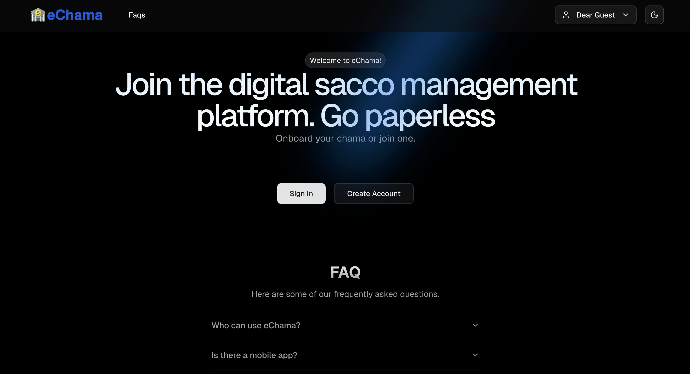
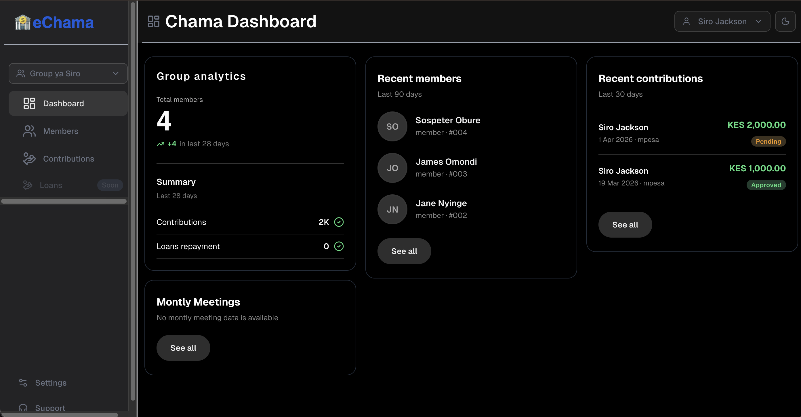
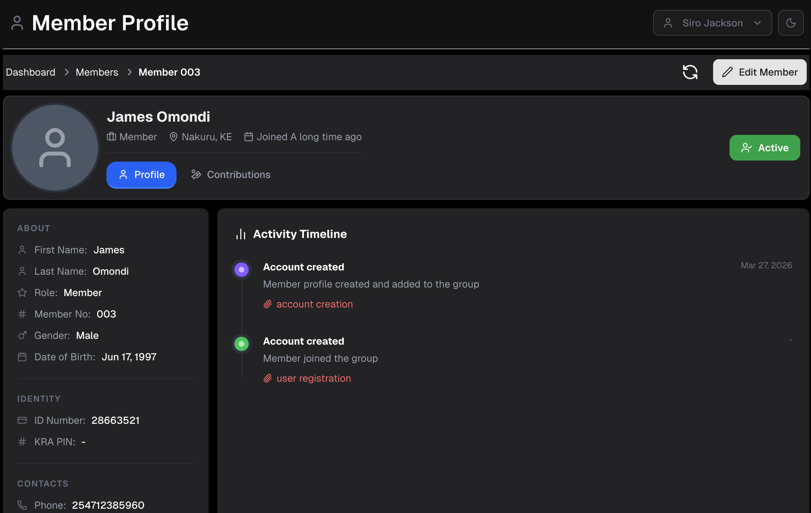
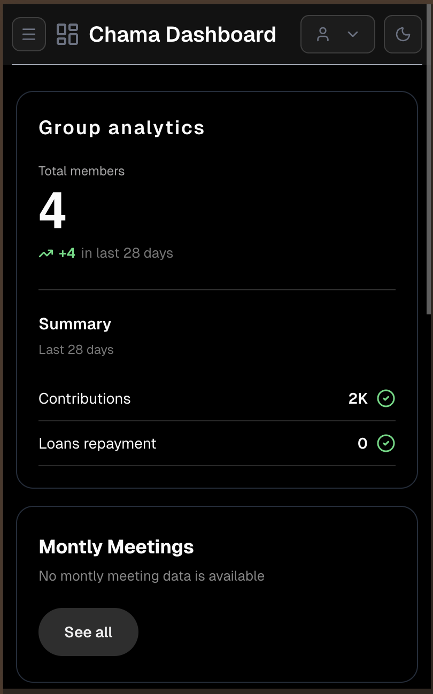
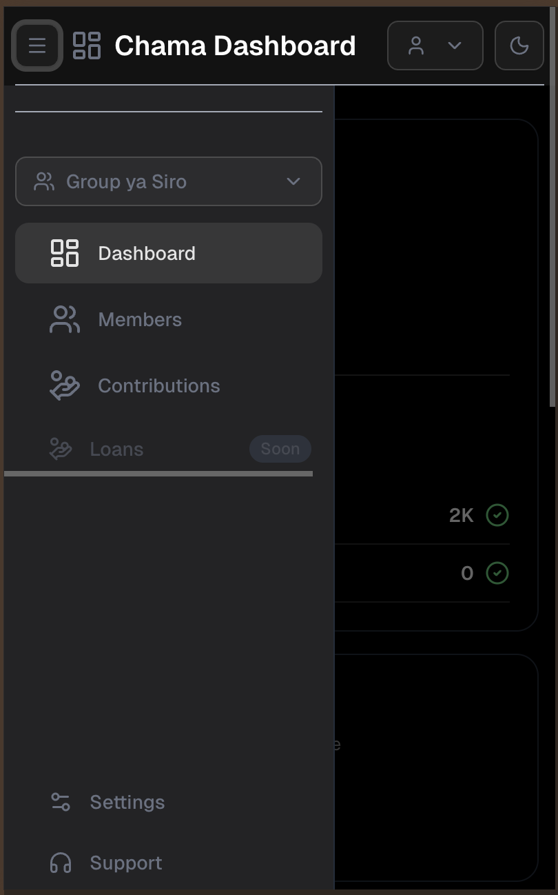
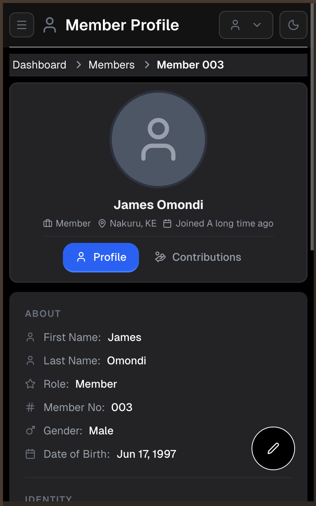

# e-Chama — Digital Sacco Management System 

e-Chama is a modern, full-stack web application that helps chamas (savings groups) and SACCOs manage their operations digitally — from onboarding members and tracking contributions to scheduling meetings and analysing group performance, all in one place.

---
## Screenshots

| | |
|---|---|
|  |  |

| | | | |
|---|---|---|---|
|  |  |  |  |

---

## Table of Contents

- [Overview](#overview)
- [Features](#features)
- [Tech Stack](#tech-stack)
- [Architecture](#architecture)
- [Project Structure](#project-structure)
- [Getting Started](#getting-started)
- [Environment Variables](#environment-variables)
- [Contributing](#contributing)

---

## Overview

A **chama** is an informal cooperative savings group common in East Africa. e-Chama brings these groups online with a secure, role-aware platform that supports both group administrators and regular members. Groups can be created with a unique invite code, contributions can be logged with full audit trails, and an analytics dashboard gives admins real-time visibility into group health.

e-Chama is currently browser-only but is also mobile responsive.

---

## Features

### Authentication & Security
- **Sign Up / Sign In / Sign Out** via Supabase Auth
- JWT-based sessions with `jwt-decode` for client-side token inspection
- Route-level protection enforced in Next.js middleware — unauthenticated users are redirected to `/signin`; authenticated users are bounced away from auth pages automatically
- Password validation with Zod schema (minimum 8 characters, password confirmation matching)

### Group Management
- **Create a Group** — set a title, description, location, address, and initials/avatar
- **Unique Group Code** — each group gets a shareable code so members can find and join it
- **Search Groups by Code** — users can look up a group and view its member count before requesting to join
- **Join / Leave a Group** — with duplicate-membership prevention enforced at the database layer
- **User Groups View** — paginated list of all groups a user belongs to, with search

### Member Management
- **Add New Members** — form-driven onboarding with schema validation (name, member number, role)
- **Edit Member Details** — update member number and role
- **Role-Based Access** — `admin` and `member` roles drive what each user sees and can do
- **Member Profiles** — dedicated profile page per member showing personal details and contribution history on tabbed views
- **Recent Members Widget** — dashboard card showing the latest additions to the group

### Contributions
- **Log Contributions** — capture amount, payment mode (e.g., M-Pesa, bank), reference number, reason, status, and optional attachment or note
- **Update & Delete Contributions** — full CRUD with timestamps
- **Filter & Paginate** — contributions table supports pagination and column sorting
- **Total Contributions Summary** — aggregated contribution totals over a configurable date window, per group or per member
- **Recent Contributions Widget** — dashboard card with the latest three transactions

### Meetings
- **Schedule Meetings** — create meetings with title, description, date, and location
- **View & Manage Meetings** — full CRUD on meeting records, with paginated table view
- **Monthly Meetings Overview** — calendar-style widget on the admin dashboard

### Dashboards
- **Admin Dashboard** — group-wide analytics including total member count, total contributions over the last 28 days, loan repayment placeholder, monthly meetings chart, recent members list, and recent contributions list
- **Member Dashboard** — personalised view scoped to the logged-in member's own activity
- **Stat Cards** — animated summary cards with growth indicators

### Profiles & Settings
- **User Profile Page** — view and manage personal information
- **Settings Page** (tabbed):
  - *Profile Tab* — update display name and personal details
  - *Security Tab* — manage password and account security
- **Avatar & Initials** support for group and user avatars

### Landing Page
- Animated **Hero** section with tagline and CTA
- **Stats** section highlighting platform metrics
- **Partners / Logos** strip
- **Testimonials** carousel
- **Pricing** section (see Pricing Plans below)
- **FAQ** accordion
- **Navbar** and **Footer** with navigation links

### UI & UX
- **Light / Dark theme** toggle powered by `next-themes`
- **Framer Motion** animations throughout landing page sections
- **Sonner** toast notifications for user feedback
- **Skeleton loaders**, **empty states**, **error alerts**, and **not-found states** for every data-driven view
- **Responsive layout** with Tailwind CSS — sidebar collapses on mobile
- **Breadcrumb navigation** and group-contextual `GroupNav` component

### Observability
- **Sentry** integrated for error monitoring on both the client and server (edge-compatible config)

---

## Tech Stack

| Layer | Technology |
|---|---|
| Framework | Next.js 16 (App Router) |
| Language | TypeScript 5 |
| UI Library | React 19 |
| Styling | Tailwind CSS v4, Radix UI Themes |
| Component Primitives | Radix UI, shadcn/ui-style components |
| Animations | Framer Motion |
| Charts | Recharts |
| Forms | React Hook Form + Zod |
| State Management | Redux Toolkit + Redux Persist |
| Server State / Caching | TanStack React Query v5 |
| Backend / Database | Supabase (PostgreSQL + Auth + Storage) |
| Error Monitoring | Sentry |

---

## Architecture

e-Chama follows **Clean Architecture** principles, organising code into four clearly separated layers:

```
src/
├── domain/          # Core business entities and repository interfaces
├── application/     # Use cases, Redux slices, and helper utilities
├── infrastructure/  # Supabase service implementations and DI container
└── presentation/    # React components, layouts, hooks, and providers
```

**Domain Layer** defines the entities (`Group`, `Member`, `Contribution`, `Meeting`, `Profile`, `AppUser`, `Permission`) and repository contracts (`auth.repo.ts`, `profile.repo.ts`, `base.supabase.repo.ts`).

**Application Layer** contains use cases for authentication (`signin`, `signup`, `signout`), group management, member management, and contribution management. Redux slices (`authSlice`, `appSlice`, `navSlice`) hold global UI and session state, persisted across page reloads via `redux-persist`.

**Infrastructure Layer** provides the concrete Supabase implementations (`AuthRepoImpl`, `ProfileRepoImpl`) and service modules (`groupService`, `memberService`, `contributionService`, `authService`, `userService`, `profileService`, `verifyService`). A dependency injection container (`container.ts`) wires everything together.

**Presentation Layer** houses all React components broken down into `components/ui` (primitives), `components/common` (shared layout pieces), `components/tables` (reusable paginated tables), `layout/` (feature-level page sections), `hooks/` (custom React hooks), and `providers/` (context and theme wrappers).

---

## Project Structure

```
├── src/
│   ├── app/                       # Next.js App Router pages
│   │   ├── (auth)/                # Public auth pages: /signin, /signup
│   │   ├── (protected)/           # Authenticated pages
│   │   │   ├── contributions/     # Contributions list & form
│   │   │   ├── groups/            # Groups list
│   │   │   ├── meetings/          # Meetings list & form
│   │   │   ├── members/           # Members list, new member, member profile & edit
│   │   │   ├── profile/           # User profile
│   │   │   └── settings/          # Settings (profile + security tabs)
│   │   ├── api/                   # API routes (Sentry example)
│   │   └── user/[userId]/         # User-scoped settings route
│   ├── application/
│   │   ├── helpers/               # Error utilities, general utils
│   │   ├── state/                 # Redux store, slices (auth, app, nav)
│   │   └── use-cases/             # Business logic: auth, user, supabase CRUD
│   ├── domain/
│   │   ├── entities/              # TypeScript interfaces for all domain models
│   │   └── repositories/          # Repository contracts and base Supabase repo
│   ├── infrastructure/
│   │   ├── di/                    # Dependency injection container
│   │   ├── implementations/       # Concrete repo implementations
│   │   └── services/              # Supabase service modules per domain area
│   ├── lib/                       # Supabase client helpers and shared utilities
│   ├── presentation/
│   │   ├── components/            # reusable components, pagination, table parts
│   │   ├── hooks/                 # app hooks
│   │   ├── layout/                # Feature layouts
│   │   └── providers/             # MainLayout and Providers
│   ├── types/                     # Shared TypeScript type definitions
│   ├── middleware.ts              # Route protection middleware
│   ├── instrumentation.ts         # Sentry server instrumentation
│   └── instrumentation-client.ts  # Sentry client instrumentation
└── supabase/
    └── migrations/                # Database migration SQL files
```

---

## Getting Started

### Prerequisites

- Node.js 18+
- A [Supabase](https://supabase.com) project (free tier works)

### Installation

```bash
git clone https://github.com/SiroDevs/e-chama.git
cd e-chama
```

```bash
npm install
```

```bash
cp .env.example .env.local
```

```bash
npm run dev
```

Open [http://localhost:3000](http://localhost:3000) in your browser.

### Available Scripts

| Script | Description |
|---|---|
| `npm run dev` | Start development server |
| `npm run build` | Build for production |
| `npm run start` | Start production server |
| `npm run lint` | Run ESLint |

---

## Environment Variables

Create a `.env.local` file in the root of the project with the following variables:

```env
# Supabase
NEXT_PUBLIC_SUPABASE_URL=https://your-project.supabase.co
NEXT_PUBLIC_SUPABASE_ANON_KEY=your-anon-key

# Sentry (optional — for error monitoring)
SENTRY_DSN=your-sentry-dsn
SENTRY_AUTH_TOKEN=your-sentry-auth-token
```

You can find your Supabase URL and anon key in your Supabase project under **Settings → API**.


---

## Contributing

Contributions are welcome! Please open an issue first to discuss what you'd like to change, then submit a pull request against the `main` branch.

1. Fork the repository
2. Create a feature branch: `git checkout -b feature/your-feature-name`
3. Commit your changes: `git commit -m "feat: add your feature"`
4. Push to the branch: `git push origin feature/your-feature-name`
5. Open a Pull Request
